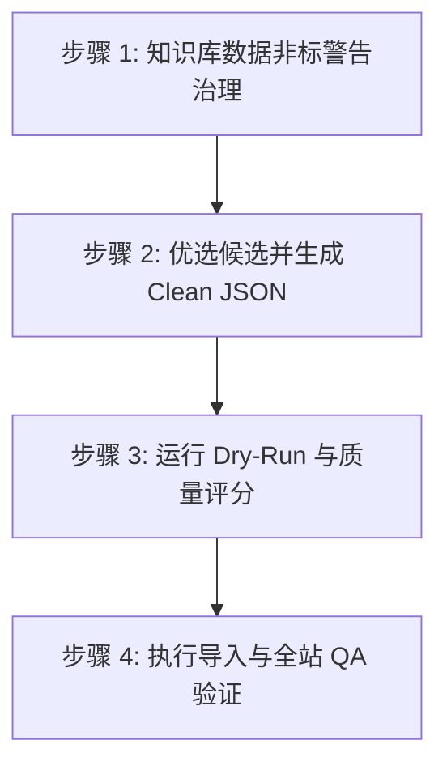

# 知识库治理与渐进式入库计划 (下一步工作规划)

本计划旨在明确从本地 500 条知识库候选数据中筛选优质主体，进行格式治理，并分批次清洗、验证并正式导入网站数据库的步骤与标准。

## 1. 目标与边界

* **当前状态**：正式企业库 50 家，正式院校库 32 所；本地知识库拥有 500 条非重复候选（企业 457 家，院校 43 所）。
* **下一步核心目标**：
  1. 对知识库中的 **62 处非标警告**进行数据清洗与修正，统一数据底座。
  2. 从 500 条候选池中筛选出“证据等级为强、入口稳定、招聘/招生页面完备”的优质候选（预计首批选择 **5-8 家企业** 和 **2-4 所院校**）。
  3. 将筛选出的候选清洗为符合规范的 `clean JSON`，通过 dry-run 和质量评分（>=85 分），最终安全导入正式库。
* **边界与红线**：
  * 只使用项目内置的导入脚本修改 `src/data/companies.ts` 和 `src/data/universities.ts`。
  * 严禁对 VPS、部署环境、Nginx、域名进行任何直接修改。
  * 严格控制薪资、作息、招生等关键数据的事实边界，无强证据一律保持 `未知` 或 `待核对`。

## 2. 拟实施的四个步骤



### 步骤 1：知识库数据非标警告治理
对我们在扫描中发现的 62 个警告进行批量或手动修正：
* **企业性质非标修正**：批量将 `国企体系`、`国企上市` 等非标字段名标准化为 `国企`；将 `民企上市`、`民企港股` 标准化为 `民企`。
* **重复 URL 清理**：对 `enterprise-scout-2026-06-09-1330.raw.json` 中 8 家企业的 sources 重复链接进行手动或脚本去重，保留单一有效的具体来源。
* **Batch 9 字段映射**：在做 Batch 9 清洗时，特殊映射 `keyEntries` -> `keyLinks`，`sourceLinks` -> `sources`。

### 步骤 2：优选候选并生成 Clean JSON
从知识库中挑出首批高价值的主体进行清洗：
* **企业优选（首批 5-8 家）**：
  * 优先考虑：`华荣科技股份有限公司` (防爆电气龙头)、`新黎明科技股份有限公司` (防爆器件)、`飞策防爆电器股份有限公司` (防爆照明) 等具有强证据且方向直接的企业。
  * 清洗为：`research-drafts/companies/企业名-clean-2026-06-10.json`。
* **院校优选（首批 2-4 所）**：
  * 优先考虑：考研/跨考强相关的院校（如 `中国科学技术大学` - 火灾安全重点实验室爆炸动力学方向；`北京科技大学` - 矿山与火灾安全科学方向）。
  * 清洗为：`research-drafts/universities/院校名-clean-2026-06-10.json`。

### 步骤 3：运行 Dry-Run 与质量评分
对生成的草稿进行自动化质量检测：
* **院校 Dry-run**：
  ```bash
  npm run import:university -- "research-drafts/universities/学校名-clean-2026-06-10.json" --dry-run
  ```
* **企业 Dry-run**：
  ```bash
  npm run import:company -- "research-drafts/companies/企业名-clean-2026-06-10.json" --dry-run
  ```
* **运行评分**：
  ```bash
  npm run score:drafts -- "research-drafts/companies/企业名-clean-2026-06-10.json"
  ```
  * 质量红线：**评分必须 >= 85 且无任何阻塞项**（如 description >40 字、sources 不足、非法 url 等）。

### 步骤 4：执行导入与全站 QA 验证
* **执行正式导入**：去掉 `--dry-run` 标志写入正式数据文件。
* **运行数据质量扫描**：
  ```bash
  npm run check:data-quality
  ```
* **运行路由与全站 QA**：
  ```bash
  npm run qa
  ```
  确保新增数据后，页面能正常渲染，路由无死链，编译无错。

## 3. 验证与交付计划

* **格式与数据合规**：所有导入主体必须完美通过 `npm run check:data-quality`。
* **页面渲染完整性**：通过 `npm run qa:routes` 自动扫描确认所有新增企业和院校的详情页面均能成功加载，无 React/Vue 渲染崩溃。
* **备份恢复机制**：在修改正式 `src/data/*.ts` 数据文件前，自动创建备份以防万一。
